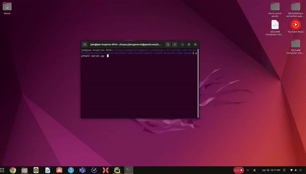

# Multi-Party Chat

# Overview

This is a multi-party client/server based chat. The server runs on one
machine and many clients can connect to it. The server spawns a client
instance so that the person who hosts the server can participate in chat as
well.

The program leverages: 
- the curses library for a better than plain old CLI GUI
- threading
- select for I/O multiplexing
- multiprocessing 
- and of course...
- SOCKETS!!!

The client will show the current username at the top of the screen, and
colorizes each unique username in the chat panel. Input is currently limited
to 120 characters or fewer. This program demonstrates a simple proof-of-concept
that it's possible to leverage sockets and some basic threading/multiprocessing
to build a basic AIM-style chat client.




# Running

- THE SERVER MUST BE RUN FIRST! The server.py file automatically starts a client 
  session after the server is running.
- If you get an error starting the server due to a port already in use, you
  can change the PORT variable in both client.py (Line 12) and server.py (Line 
  14)
- This program has been tested with up to 12 clients (including the server 
  client) connected at once and worked flawlessly. This cap can be modified by 
  changing the value of MAX_CONNECTIONS in server.py (Line 17)


```bash

# Terminal 1
python3 server.py [-p]

# Terminal 2+
python3 client.py
```

You will be prompted for your name, and then be admitted to the chat.

Note: Without the `-p` switch, the server will operate in "non-persistent" mode.
That is, the server shuts down when the client spawned by the server.py file
receives the 'q' command.

Using the `-p` switch, the server operates in "persistent" mode and will keep
running until the following two conditions are met:

1.  At least one client (including the server user) has connected to the server
2.  All client sockets have disconnected.

> If you get an error at runtime concerning `_curses.init_pair()` run the following command in your terminal and try again `export TERM="xterm-256color"`

## Server.py

The server works by activating a listener socket at startup and then evaluating
the socket continuously for readability. When it finds the socket is in a
readable state, it accepts the connection creating a new socket with that
client, and then spins off the socket in a new thread, where that client is
serviced until it disconnects.

The server handles multi-party chat by simply receiving messages from clients
and echoing the messages back to each client. It maintains a list of connected
clients for this purpose.

The server will shut down when all clients have disconnected under the condition
that at least one client has connected first.


## Client.py

The client starts by asking the user for their name. The GUI is then loaded, 
presenting the user with an appropriately sized chat box, with input being 
at the bottom adjacent to a '>' character. The user can type messages up to the 
length of the line and then submit by hitting the ENTER key. The user can close 
the client and disconnect by typing 'q' at the prompt.


## Terminal.py

The bread and butter of the program. Written using the curses library for 
Python, it enables a user to participate in the chat session. See the code for comments and more details
on the functions contained within.


# Sources


Python Socket Library:

https://docs.python.org/3/library/socket.html
https://docs.python.org/3/howto/sockets.html


Python Threading Library:
https://docs.python.org/3/library/threading.html

Python Select Library (for I/O Multiplexing):
https://docs.python.org/3/library/select.html